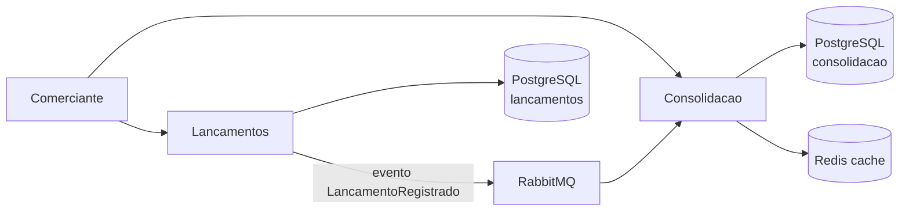

# Fluxo de Caixa do Comerciante

Solução de arquitetura e implementação em **C# / .NET 9** para o desafio de Arquiteto de Soluções: controlar o fluxo de caixa diário (créditos e débitos) e fornecer o **saldo diário consolidado**.

## Como a solução atende o desafio

| Exigência | Como foi atendida |
| --- | --- |
| Mapeamento de domínios e capacidades | [docs/01-dominios-e-capacidades.md](docs/01-dominios-e-capacidades.md) |
| Refinamento de requisitos | [docs/02-requisitos.md](docs/02-requisitos.md) |
| Arquitetura alvo | [docs/03-arquitetura-alvo.md](docs/03-arquitetura-alvo.md) |
| Justificativa de tecnologias | [docs/04-justificativa-tecnologica.md](docs/04-justificativa-tecnologica.md) |
| Segurança, resiliência e escala | [docs/05-seguranca-resiliencia-escalabilidade.md](docs/05-seguranca-resiliencia-escalabilidade.md) |
| Dois serviços de negócio | `Lancamentos.Api` e `Consolidacao.Api` |
| Testes | `dotnet test FluxoCaixa.slnx` |
| Execução local | Docker Compose ou `dotnet run` |

## Arquitetura em uma frase

Dois **microsserviços** (bounded contexts) com **Clean Architecture**, comunicação **assíncrona** via eventos (`LancamentoRegistrado`) e **consistência eventual** no relatório de saldo.



## Pré-requisitos

- [.NET 9 SDK](https://dotnet.microsoft.com/download)
- [Docker Desktop](https://www.docker.com/products/docker-desktop/) (recomendado)

## Executar localmente (recomendado)

Sobe PostgreSQL, RabbitMQ, Redis e as duas APIs:

```bash
docker compose up --build
```

Serviços:

| Serviço | URL |
| --- | --- |
| Lançamentos (Swagger) | http://localhost:5081/swagger |
| Consolidação (Swagger) | http://localhost:5082/swagger |
| RabbitMQ Management | http://localhost:15672 (guest/guest) |
| Health Lançamentos | http://localhost:5081/health |
| Health Consolidação | http://localhost:5082/health |

### Infraestrutura apenas + APIs no host

```bash
docker compose up postgres rabbitmq redis -d
dotnet run --project src/Lancamentos.Api
dotnet run --project src/Consolidacao.Api
```

As APIs no host usam PostgreSQL na porta **5433** e Redis na **6380**, para não conflitar com instalações locais (Postgres 17, outro Redis, etc.). Dentro do Docker a porta interna continua 5432/6379.

## Fluxo de uso

Credenciais de demonstração (não usar em produção):

- usuário: `comerciante`
- senha: `Fluxo@2026`

```bash
# 1. Token
curl -s -X POST http://localhost:5081/api/v1/auth/token ^
  -H "Content-Type: application/json" ^
  -d "{\"usuario\":\"comerciante\",\"senha\":\"Fluxo@2026\"}"

# 2. Crédito (tipo 1 = Credito, 2 = Debito)
curl -s -X POST http://localhost:5081/api/v1/lancamentos ^
  -H "Authorization: Bearer TOKEN" ^
  -H "Content-Type: application/json" ^
  -d "{\"tipo\":1,\"valor\":150.50,\"data\":\"2026-08-17\",\"descricao\":\"Venda no balcao\"}"

# 3. Débito
curl -s -X POST http://localhost:5081/api/v1/lancamentos ^
  -H "Authorization: Bearer TOKEN" ^
  -H "Content-Type: application/json" ^
  -d "{\"tipo\":2,\"valor\":40.00,\"data\":\"2026-08-17\",\"descricao\":\"Pagamento fornecedor\"}"

# 4. Saldo consolidado (aguarde 1–2s pela consistência eventual)
curl -s http://localhost:5082/api/v1/saldos/2026-08-17 ^
  -H "Authorization: Bearer TOKEN"

# 5. Listagens paginadas (pagina padrão = 1, tamanhoPagina padrão = 20, máximo 100)
curl -s "http://localhost:5081/api/v1/lancamentos?data=2026-08-17&pagina=1&tamanhoPagina=20" ^
  -H "Authorization: Bearer TOKEN"
curl -s "http://localhost:5082/api/v1/saldos?inicio=2026-08-15&fim=2026-08-17&pagina=1&tamanhoPagina=20" ^
  -H "Authorization: Bearer TOKEN"
```

Resposta esperada do saldo:

```json
{
  "data": "2026-08-17",
  "totalCreditos": 150.50,
  "totalDebitos": 40.00,
  "saldo": 110.50,
  "quantidadeLancamentos": 2,
  "atualizadoEm": "..."
}
```

## Testes

```bash
dotnet test FluxoCaixa.slnx
```

Inclui testes de domínio, aplicação (handlers com mocks) e testes de API com `WebApplicationFactory` (banco e bus em memória).

## Estrutura do repositório

```
src/
  Shared.Contracts/          Contratos de integração (eventos)
  Lancamentos.*              Contexto de lançamentos (Clean Architecture)
  Consolidacao.*             Contexto de consolidação diária
tests/
docs/                        Documentação arquitetural obrigatória
docker-compose.yml
```

## Decisões principais (resumo)

1. **Microsserviços, não monolito** — o enunciado pede dois serviços e a segregação de capacidades é o núcleo do papel de arquiteto.
2. **Eventos, não orquestração síncrona** — o relatório não precisa ser transacional com o lançamento; desacopla disponibilidade.
3. **Database per service** — cada contexto tem o próprio modelo e o próprio banco.
4. **Idempotência na consolidação** — reentrega de mensagem (at-least-once) não duplica saldo.
5. **O que não foi implementado em código** está documentado como arquitetura alvo (API Gateway, outbox transacional, observabilidade completa). Ver [docs/03-arquitetura-alvo.md](docs/03-arquitetura-alvo.md).
