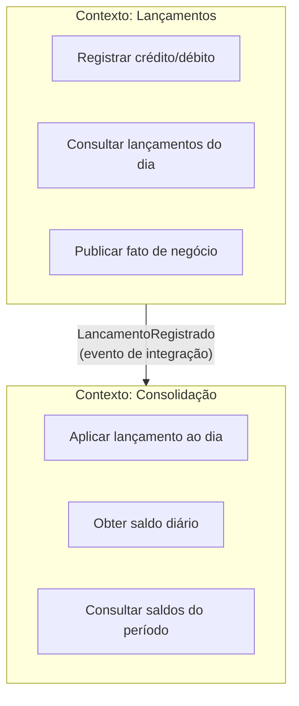
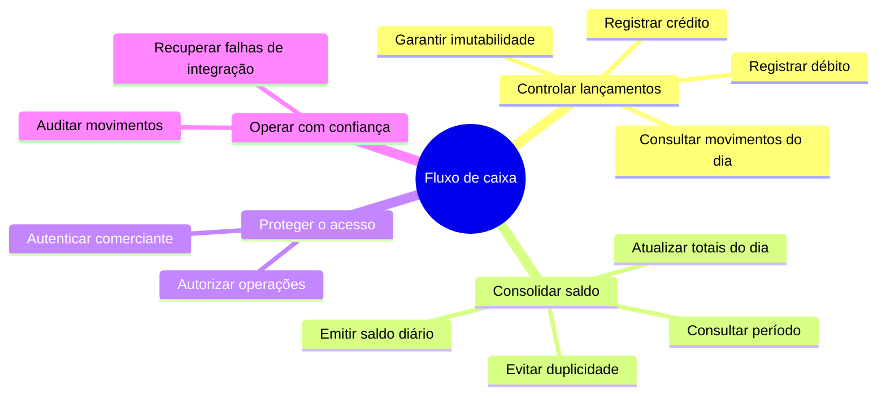
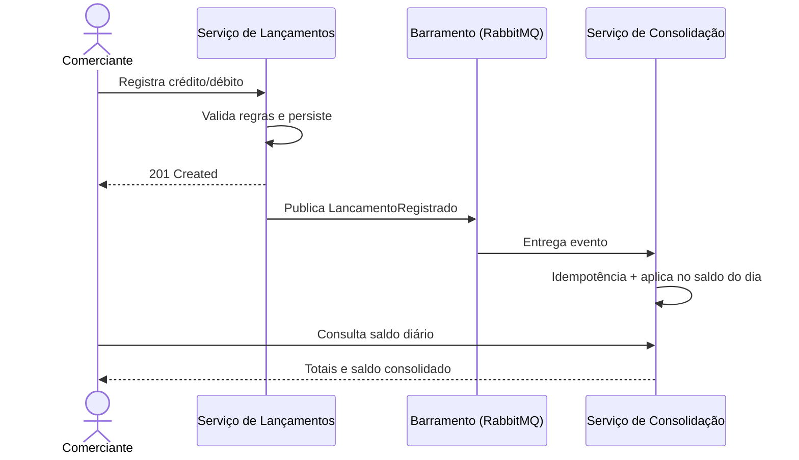

# 1. Domínios funcionais e capacidades de negócio

## Contexto de negócio

O comerciante precisa **enxergar o caixa do dia**: o que entrou (créditos), o que saiu (débitos) e quanto restou. São duas perguntas distintas, com ciclos de vida e padrões de acesso diferentes:

1. **Registrar um movimento** — operação de escrita, crítica, com regras contábeis.
2. **Consultar o consolidado do dia** — operação de leitura, analítica, tolerante a atraso de segundos.

Essa diferença justifica **dois bounded contexts**, alinhados ao enunciado (“um serviço de lançamentos” e “um serviço de saldo consolidado diário”).

## Mapa de contextos (DDD)

### Linguagem ubíqua

| Termo | Significado |
| --- | --- |
| Lançamento | Movimento imutável de caixa (crédito ou débito) |
| Crédito | Entrada de recurso (aumenta o saldo) |
| Débito | Saída de recurso (diminui o saldo) |
| Data do caixa | Dia de negócio ao qual o lançamento pertence (`DateOnly`) |
| Saldo diário consolidado | `créditos − débitos` daquela data |
| Consistência eventual | O saldo reflete o lançamento após o consumo do evento |

## Capacidades de negócio

| Capacidade | Contexto | Serviço | Endpoint principal |
| --- | --- | --- | --- |
| Registrar lançamento | Lançamentos | `Lancamentos.Api` | `POST /api/v1/lancamentos` |
| Consultar lançamentos | Lançamentos | `Lancamentos.Api` | `GET /api/v1/lancamentos?data=` |
| Consolidar saldo do dia | Consolidação | `Consolidacao.Api` | consumidor do evento |
| Emitir saldo diário | Consolidação | `Consolidacao.Api` | `GET /api/v1/saldos/{data}` |
| Consultar saldos do período | Consolidação | `Consolidacao.Api` | `GET /api/v1/saldos?inicio=&fim=` |

## Por que dois contextos (e não um módulo único)

| Critério | Lançamentos | Consolidação |
| --- | --- | --- |
| Modelo | Documento imutável do movimento | Agregado acumulador do dia |
| Padrão de carga | Writes pontuais | Reads frequentes + writes por evento |
| Consistência | Forte no próprio agregado | Eventual em relação à origem |
| Evolução | Novos tipos, categorias, anexos | Projeções, dashboards, fechamento |
| Falha isolada | Caixa continua registrando mesmo se o relatório estiver atrasado | Relatório pode degradar sem bloquear o PDV |

Um único banco compartilhado acoplaria os modelos e impediria escalar a leitura do relatório sem pressionar a escrita do caixa. A segregação é a decisão de arquitetura corporativa pedida no desafio: **responsabilidades distribuídas e capacidades isoladas**, com integração explícita.

## Cadeia de valor

O valor para o comerciante não é “persistir uma linha”: é **tomar decisão no dia** (comprar, sangrar caixa, fechar o expediente) com um consolidado confiável. A arquitetura separa a captura do fato da projeção gerencial.
