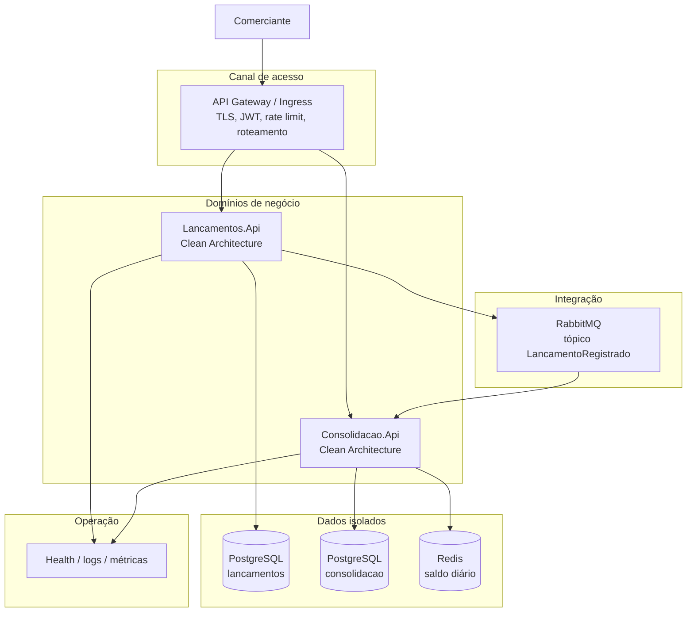
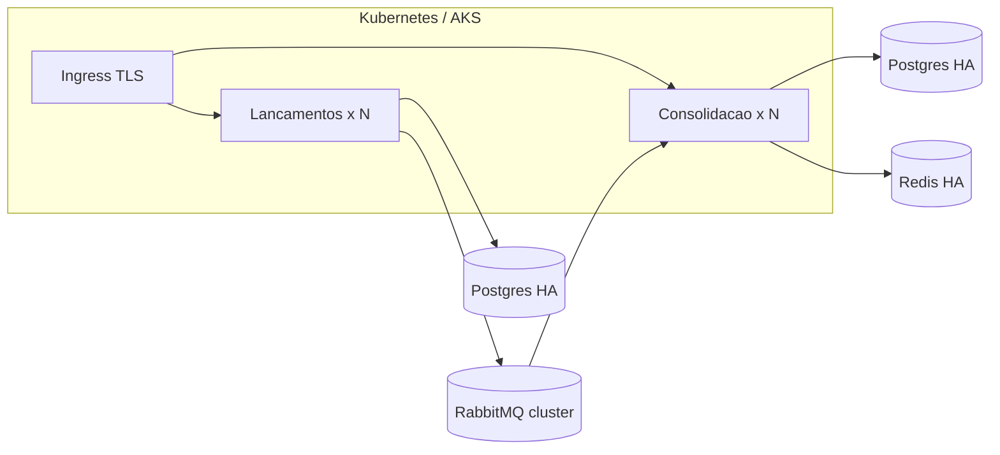

# 3. Arquitetura alvo (Target Architecture)

## Estilo escolhido

**Microsserviços por bounded context**, com Clean Architecture internamente e integração **event-driven**.

Não é serverless (o domínio tem estado e regras contínuas). Não é SOA clássico com ESB. Não é monolito modular — embora esse fosse um bom *ponto de partida* se o time fosse um só e o volume, baixo. A escolha e os trade-offs estão no [ADR 001](adr/001-estilo-arquitetural.md).

## Visão lógica



## Visão de camadas (cada serviço)

```
Api            HTTP, auth, ProblemDetails, Swagger
Application    casos de uso (MediatR), validação
Domain         regras e invariantes (sem IoC, sem EF)
Infrastructure EF Core, MassTransit, Redis, relógio
```

A dependência aponta **para dentro**. O domínio não conhece fila, banco nem HTTP.

## O que está implementado vs. o que é alvo

O enunciado pede que as premissas arquiteturais estejam nas **decisões e na documentação**, mesmo quando não forem 100% codificadas. Distinção honesta:

| Premissa | Neste repositório | Arquitetura alvo (produção) |
| --- | --- | --- |
| Dois serviços e dois bancos | Sim | Igual |
| Eventos via RabbitMQ | Sim (MassTransit) | Igual + DLQ operacional |
| JWT | Sim (emissor de demonstração) | Identity Provider (Entra ID / Keycloak) |
| Cache do saldo | Sim (Redis ou memória) | Redis Cluster |
| Rate limit | Sim (100 req/min) | No Gateway, por cliente |
| Health check | Sim | + readiness/liveness no orquestrador |
| API Gateway | Documentado | YARP / ingress Kubernetes |
| Outbox transacional | Documentado (ADR 002) | MassTransit EF Outbox |
| Observabilidade | Serilog + health | OpenTelemetry + Prometheus + Grafana |
| Segredos | appsettings de demo | Vault / Azure Key Vault |
| Multi-AZ / failover | Documentado | Kubernetes + Postgres HA + RabbitMQ cluster |

## Fluxo de dados

1. `POST /lancamentos` valida, persiste o agregado e devolve `201`.
2. Publica `LancamentoRegistrado` no barramento.
3. `Consolidacao` consome, verifica idempotência, atualiza `SaldoDiario`, invalida cache.
4. `GET /saldos/{data}` lê cache ou banco e devolve o consolidado.

Falha entre 1 e 2: o lançamento existe e o evento pode ser republicado (ver outbox no alvo).  
Falha no consumidor: a mensagem retenta com backoff; DLQ no alvo.  
Reentrega: `lancamentos_processados` impede saldo duplicado.

## Comunicação

| Integração | Protocolo | Formato | Ferramenta |
| --- | --- | --- | --- |
| Cliente → APIs | HTTP/JSON REST | JSON | ASP.NET Core |
| Lançamentos → Consolidação | AMQP | JSON (MassTransit) | RabbitMQ |
| Contratos | assembly compartilhado | record C# | `Shared.Contracts` |

Não há chamada síncrona entre os dois serviços. Isso evita cascata de falha no momento do registro do caixa.

## Implantação alvo



Cada API é **stateless**: escala horizontal com réplicas atrás de um balanceador. A consolidação escala pelo número de consumidores da fila (prefetch limitado para não sobrecarregar o banco).
